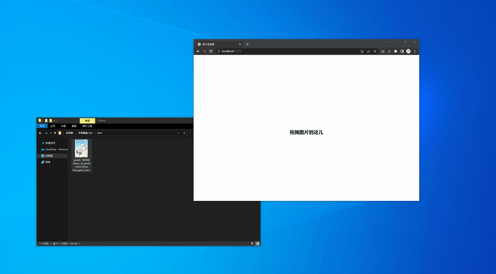

# 图片查看器

好吧，只是发现了 [web filesystem api](https://web.dev/patterns/files/)，以及令人震惊的文件管理器集成，所以写个 demo 测试一下。

演示

验证

- web fs api 很底层，目前非常不完善，例如没有包括 move 功能
- 集成到文件系统可以在 windows 上生效，这似乎让某些 electron 客户端不再有存在的必要 -- 如果需要 nodejs，这仍然是一个问题，但或许最终这会被解决
- 集成到文件系统在 android 上无法使用
